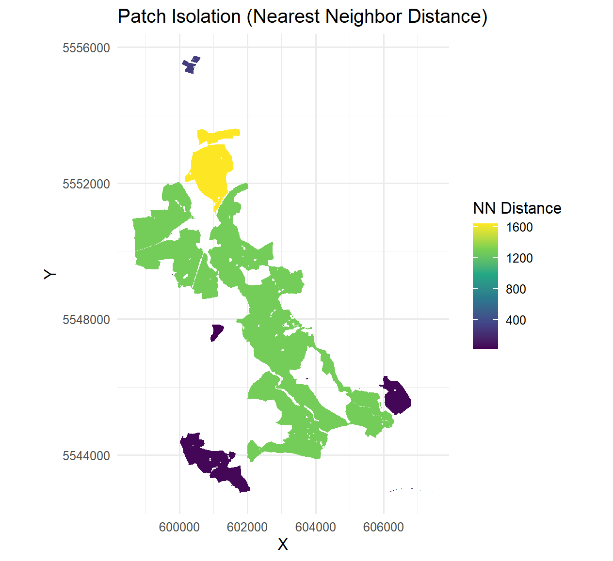

<!-- README.md is generated from README.Rmd. Please edit that file -->

## forestFragR

<!-- badges: start -->
<!-- badges: end -->

forestFragR is an R package for analyzing forest fragmentation and landscape connectivity from raster data. It provides a streamlined workflow for preprocessing land cover data, identifying forest patches, computing landscape metrics, and assessing connectivity.

The package builds on the terra ecosystem, making it efficient for handling large spatial datasets.

## Installation

You can install the development version of forestFragR from GitHub with:

``` r
# Install devtools if you haven't yet
install.packages("devtools")

# Then install the package
devtools::install_github("PBirungi/forestFragR")
```

## How it works
The user provides only two inputs:

- A land cover raster (e.g., ESA WorldCover `.tif`)
- An Area of Interest (AOI) as a vector file (`.shp`, `.gpkg`, etc.)


### Workflow Overview

| Function | What it does | Output |
|----------|-------------|--------|
| `prepare_data()` | Validates inputs, checks CRS, reprojects if needed, and clips/masks raster to AOI | List with processed raster, AOI, and CRS |
| `preprocess_forest()` | Converts land cover raster into binary forest/non-forest using specified class | Binary forest raster (1 = forest, 0 = non-forest) |
| `analyze_patches()` | Identifies contiguous forest patches, assigns IDs, and computes patch-level metrics (area, perimeter, shape, core area) | List with patch raster and patch metrics table |
| `analyze_landscape()` | Computes landscape-level metrics (NP, TA, MPS, LPI, fragmentation and edge metrics) | Data frame of landscape metrics |
| `connectivity_analysis()` | Calculates distances between patch centroids, identifies nearest neighbors, and classifies patches as connected or isolated | List with nearest-neighbor distances and connectivity table |
| `visualize_patch_isolation()` | Generates a raster and heatmap visualization of patch isolation (nearest-neighbor distance) | Raster visualization of patch connectivity |
 

## Example 

This example uses ESA WorldCover land cover raster clipped to the University Forest AOI in Würzburg to analyze the forest fragmentation.


```{r example}
library(forestFragR)

# Load data
landcover <- load_landcover(raster_path)
aoi <- vect(aoi_path)

# Prepare data (CRS alignment, projection, clipping)
prepared <- prepare_data(landcover, aoi)

# Extract forest (ESA WorldCover: trees = 10)
forest <- preprocess_forest(prepared$raster, forest_class = 10)

# Patch analysis
patch_data <- analyze_patches(forest)

# Landscape metrics
landscape_metrics <- analyze_landscape(patch_data)

# Connectivity analysis
connectivity <- connectivity_analysis(patch_data)

# Visualization
visualize_patch_isolation(connectivity)
```

The patch isolation map. 
<p align="center">
  
</p>


The patch isolation map highlights the spatial variation in forest connectivity across the study area. Patches shown in darker colors have shorter nearest-neighbor distances and are therefore more connected to surrounding forest patches. In contrast, patches displayed in lighter colors are more isolated, indicating greater distances to the nearest neighboring forest patch.

The highly isolated patch in the northern section of the study area suggests stronger forest fragmentation in that region. Increased isolation can reduce ecological connectivity, making it more difficult for species to move between habitat patches.

More connected patches, particularly in the central and southern portions of the landscape, may provide better habitat continuity and support higher biodiversity by facilitating species movement and maintaining ecological processes. 

Overall, the results demonstrate how spatial metrics derived from remote sensing can help identify fragmentation hotspots and areas that may require conservation or restoration efforts.
