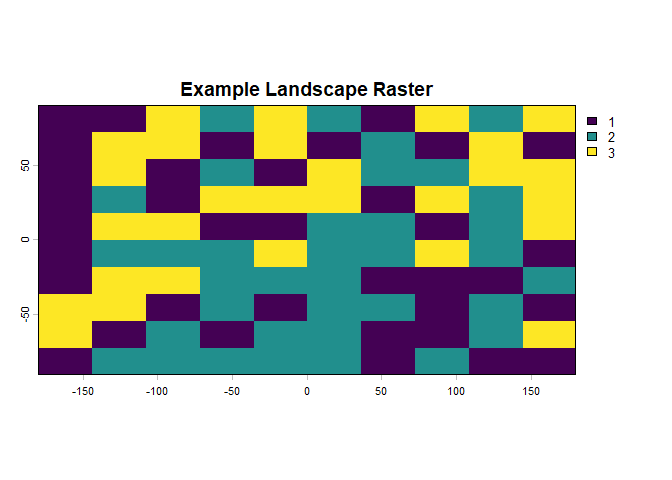

<!-- README.md is generated from README.Rmd. Please edit that file -->

# forestFragR

<!-- badges: start -->

<!-- badges: end -->

The goal of forestFragR is to provide simple functions for calculating
forest fragmentation and landscape metrics from raster data. The package
currently includes functions that wrap functionality from the
landscapemetrics package to make forest fragmentation analysis easier
and more reproducible.

## Installation

You can install the development version of forestFragR from GitHub with:

``` r
devtools::install_github("PBirungi/forestFragR")
```

## Example

This is a basic example which shows you how to calculate the number of
patches (NP) in a raster landscape.

``` r
library(forestFragR)
library(terra)
#> terra 1.8.93

# create a simple raster for demonstration
r <- rast(nrows = 10, ncols = 10)
values(r) <- sample(1:3, 100, replace = TRUE)

# visualize the raster
plot(r, main = "Example Landscape Raster")
```



``` r

# calculate number of patches
calculate_np(r)
#> # A tibble: 3 × 6
#>   layer level class    id metric value
#>   <int> <chr> <int> <int> <chr>  <dbl>
#> 1     1 class     1    NA np         6
#> 2     1 class     2    NA np         6
#> 3     1 class     3    NA np         7
```

The function returns a tibble containing the number of patches for each
land-cover class in the raster.
